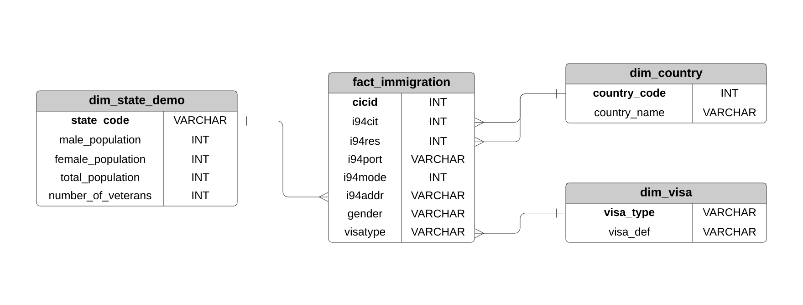
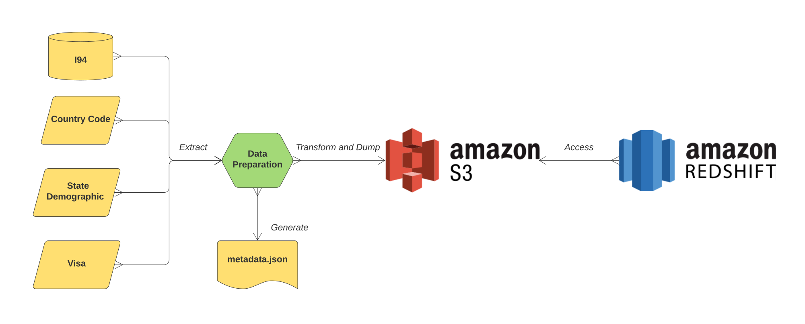

### Data Engineering Capstone Project

#### Project Summary

In this project, I designed a STAR-shape schema of the database system, containing the information of U.S. I94 immigration data, country code representation, destination state demographic summary and visa type definitions and constructed the cloud ETL pipeline in **AWS**. Specifically, data is extracted and preprocessed using **Apache Spark (PySpark)** on a provided workspace, dumped into **S3 bucket** and queried using **Redshift**.

The project follows the follow steps:
* Step 1: Scope the Project and Gather Data
* Step 2: Explore and Assess the Data
* Step 3: Define the Data Model
* Step 4: Run ETL to Model the Data
* Step 5: Complete Project Write Up

### Step 1: Scope the Project and Gather Data

The goal of this project is to construct the immigration database system efficiently, such that the the query of needed information is retrieved quickly. I worked with four dataset specifically. 

- I94 Immigration: This dataset is provided by Udacity, which contains > 3 million rows and is "big". It contains information about foreigners who have entered the U.S. without their P.I.I.. I'm using this table as the main fact table and connect other dimension tables to it. Since it's too big and the budget for the created AWS account is limited, I'm only using student visa (F1) records only. 
- US city demographic: This dataset is also proviced by Udacity, and it contains city-level demographic distributions of U.S.. I aggregated it to the level of **state** and connected it with the entering state of I94 records.
- Country code: This dataset is extracted from the given I94 label ```.SAS``` file, which contains the corresponding information of the country code used by the I94 immigration dataset.
- Visa definition: This dataset is collected from [here](https://www.trade.gov/i-94-arrivals-program), which contains the definitions of different visa types of the I94 immigration dataset.

### Step 2: Explore and Assess the Data
Check jupyter notebook for details.

### Step 3: Define the Data Model
#### 3.1 Conceptual Data Model

Data model is designed as follows:
- Fact table:
    - fact_immigration: comes from the I94 immigration data.
- Dimension table:
    - dim_country: comes from the I94 label SAS file.
    - dim_visa: comes from the collected visa definitions.
    - dim_state_demo: comes from the aggregation of city-level demographic information.
    


#### 3.2 Mapping Out Data Pipelines

The ETL pipeline is as follows: 
- Create staging, dimension and fact tables.
- Load processed ```.parquet``` files from S3.
- Insert the loaded data to the corresponding dimension and fact tables in Redshift.



### Step 4: Run Pipelines to Model the Data 
#### 4.1 Create the data model

To process the data, execute the following commands in terminal:

* ```python ./operations/create_redshift_cluster.py create```
* ```python ./operations/create_tables.py```
* ```python ./operations/etl.py```
* ```python ./operations/data_quality.py```
* ```python ./operations/create_redshift_cluster.py delete```

#### 4.2 Data Quality Checks

Two data quality checks are performed:
- whether the created table is in the workspace.
- whether the number of records in each table is identical to the preprocessed ones.

#### 4.3 Data dictionary

Fact table:
- fact_immigration:
    - **cicid**: unique id for each visitor.
    - i94cit: country code for visitor's citizenship.
    - i94res: country code for visitor's residence.
    - i94port: id of entry port.
    - i94mode: mode of entry.
    - i94addr: abbreviation of entry state.
    - gender: gender of visitor.
    - visatype: visa type of entry.

Dimension tables:
- dim_country:
    - **country_code**: code of country.
    - country_name: name of country.
- dim_visa:
    - **visa_type**: type of visa.
    - visa_def: definition of visa type.
- dim_state_demo:
    - **state_code**: abbreviation of state.
    - male_population: total population of males in the state.
    - female_population: total population of females in the state.
    - total_population: male_population: total population of the state.
    - number_of_veterans: total number of veterans in the state.
    
### Step 5: Complete Project Write Up
* Clearly state the rationale for the choice of tools and technologies for the project.
    * The fact table is the majority component in the database, so it is more efficient to store a shortened version of variables in it and link the detailed descriptions in seperate dimension tables. This is an ideal use case of the STAR-schema, where the storage of duplicated information is avoided. Tables are connected via indices (bold in the tables and figures above), and they can be joined together to generate more complex insights. For example, if a data scientist would like to know which country has the most incoming F1 student, (s)he can query
    
    ````
    SELECT 
        c.country_name AS Country, 
        SUM(i.visatype=1) AS Students 
    FROM fact_immigration i 
    JOIN dim_country c 
    ON i.i94cit = c.country_code 
    GROUP BY Country 
    ORDER BY Students DESC LIMIT 1
    ```

    * I'm saving processed data as ```.parquet``` format in S3 bucket storage, because the columnar storage format of ```.parquet``` files would significantly boost the access speed of queries and S3 works natively well with Redshift. 
    * Redshift is a power tool for data warehousing. It is scalable, distributed and cost-effective, and it is ideal to host the DB on it.
* Propose how often the data should be updated and why.
    * Normally speaking, the a weekly or a monthly update of data should be fine if the query is not emergent.
* Write a description of how you would approach the problem differently under the following scenarios:
    * The data was increased by 100x: Process all dataset on cloud. Since the other procedures are already on cloud and in distributed manners, the rest procedures should be scalable enough. 
    * The data populates a dashboard that must be updated on a daily basis by 7am every day: Schedule the execution of pipelines using tools like Apache Airflow.
    * The database needed to be accessed by 100+ people: Change the number and type of hosting nodes in Redshift.
